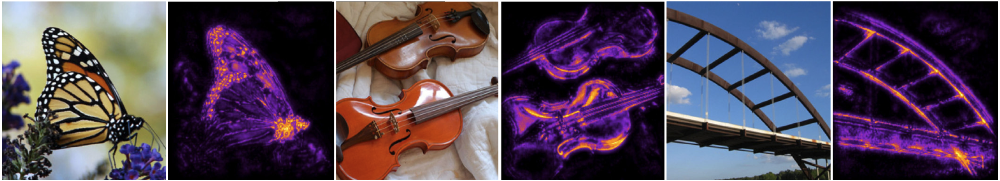
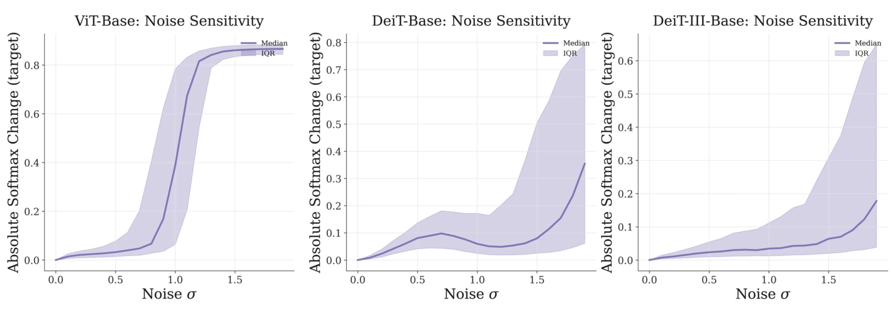

# DAVE: Distribution-aware Attribution via ViT Gradient Decomposition

<p align="center">
  
</p>

Official implementation of **DAVE**, an attribution method for Vision Transformers that extracts Effective Transformation from model's gradient and decomposes it into a clean, artifact-free, pixel-level attribution signal.


## Installation

Clone the repository and install dependencies. All commands below assume you are in the repository root.

```bash
git clone https://github.com/a-vrobell/DAVE
cd DAVE
pip install torch torchvision timm kornia numpy scipy pillow pyyaml matplotlib
```

## Quick start

```python
from core.utils.utils import get_device
from core.explainer import DAVEExplainer
from core.utils.visualization import visualize_attribution_batch

device = get_device()
model_cfg_path = "models_configs/deit3_b16_224.yaml"

# Initialize DAVE Explainer;
explainer = DAVEExplainer(
    model_cfg_path=model_cfg_path,
    device=device,
)

# Attribute images;
# x: (B, 3, H, W) images on device
# y: (B,) class indices on device
attr_maps = explainer.explain(
    x=x,
    y=y,
    num_steps=100,
    post_proc=True,
)

# Visualize results;
visualize_attribution_batch(
    attribution_map=attr_maps, 
    image_batch=x, 
    input_transform=explainer.input_transform,
)
```

## Usage

### Attribution notebooks

| Notebook | Description |
|----------|-------------|
| `attribute_imagenet_sample.ipynb` | Attribution on ImageNet toy samples |
| `attribute_multiclass.ipynb` | Multi-class attribution for a single image |

Open either notebook from the repo root so imports resolve correctly.

## Supported models

Pre-configured YAML files are provided for common timm Vision Transformers. 
Each config specifies the model, augmentation hyperparameters, and post-processing filters.

| Config | Model |
|--------|-------|
| `models_configs/deit3_b16_224.yaml` | DeiT-III-B/16 |
| `models_configs/deit3_s16_224.yaml` | DeiT-III-S/16 |
| `models_configs/deit_b16_224.yaml` | DeiT-B/16 |
| `models_configs/deit_s16_224.yaml` | DeiT-S/16 |
| `models_configs/vit_b16_224.yaml` | ViT-B/16 |
| `models_configs/vit_s16_224.yaml` | ViT-S/16 |


## Other models

To add a new model, copy an existing YAML and update `model_name` / `model_spec` (any timm `VisionTransformer` is supported).

> [!IMPORTANT]
> When adding a new timm model, remember to tune the `noise_alpha` parameter under `augment` in your YAML config. This can have a dramatic effect on attribution quality, as shown in the figure below.

<p align="center">
  
</p>

Noise addition cleans attributions by acting as a low-pass filter. However, due to different noise sensitivity across models, `noise_alpha` needs to be tuned per model. Examples of noise sensitivity for DeiT-III-B16-224, DeiT-B16-224, and ViT-B16-224 are shown below.

<p align="center">
  
</p>

## Configuration

Each YAML file has three sections:

```yaml
model:
  model_name: "DeiT-III-B16-224"                # Display name
  model_spec: "deit3_base_patch16_224.fb_in1k"  # timm model identifier

augment:
  noise_alpha: 0.9                              # Max noise level in the schedule (Remember to tune!)
  h_flip_prob: 0.5
  affine_prob: 1.0
  rotate_range: [-20.0, 20.0]
  translate_range: [0.1, 0.1]
  scale_range: [0.9, 1.1]

post_proc:
  gaussian:
    kernel_size: 11
    sgm: 7.0
  bilateral:
    kernel_size: 5
    sgm_spatial: 0.5
    sgm_range: 0.05
```

Key `explain()` arguments:

| Argument | Default | Description |
|----------|---------|-------------|
| `num_steps` | — | Number of DAVE samples |
| `post_proc` | `True` | Apply Gaussian + bilateral filtering to the final map |


## Repository structure

```
DAVE/
├── core/
│   ├── explainer.py          # DAVEExplainer — main attribution API
│   ├── config.py             # YAML-based model / augment / post-proc config
│   └── utils/
│       ├── detach_mode.py    # Effective Transformation extraction by Operator Variation removal
│       ├── augment.py        # Differentiable spatial augmentations + noise for low-pass filtering
│       ├── post_processing.py
│       ├── visualization.py
│       └── ...
├── evaluation/
│   ├── pixel_deletion.py     # Pixel deletion benchmark
│   └── utils/
├── models_configs/           # Per-model YAML configs (timm ViTs)
├── attribute_imagenet_sample.ipynb
├── attribute_multiclass.ipynb
└── run_pixel_deletion.sh     # Example evaluation command for pixel deletion
```